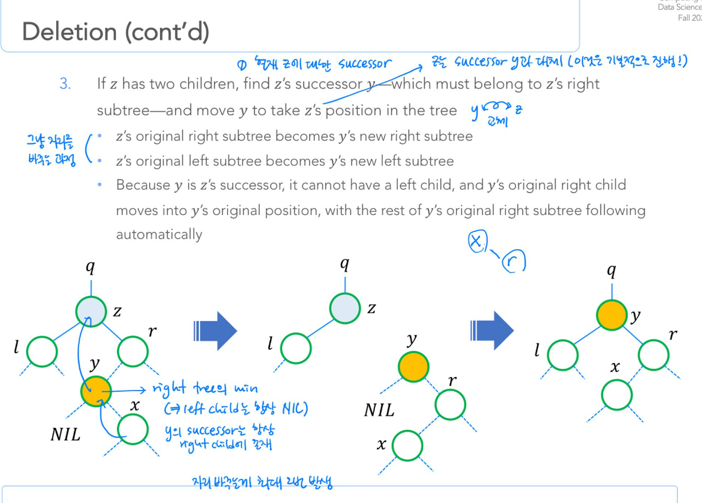

# delete operation in BST 

- pointer가 reassign되면 같은 이름을 써도 address가 달라지고 가지고 있는 값이 달라져서 이전에 있는 adrress에 있는 값은 버려짐 (dangling됨, 값을 따로 저장해두지 않는 이상 사용 불가)
- x가 y의 right child일때, x.parent.right 과 y.right은 엄연히 다른 pointer이므로 서로 가리키는 pointer를 다 update해줘야할 필요성이 있음. 
- 따라서 a의 right child node가 b인데, 이를 c로 바꿔주고 싶다면? c.parent와 c.parent.right 모두를 바꿔줘야함. 또한 a.right도 바꿔줘야함. 
\\

- update 순서
  - x -> y.right -> y.right.parent -> y.left -> y.left.parent  
  
| pointer **variable name** (변하지 않음)| address | (1) after transplant(y, y.right) |(2) y -> right = z -> right | (2) y->right->parent = y| (3) transplant(z,y) (만약 z가 parent의 right child이면) | (4) y.left = z.left | (4) y.left.p = y|
|--- |---| ---| ---| ---| ---| ---|---|
|y| 1 | - | -|
|y.parent.left| 2 | **3**| -|
|x| 3| - | -|
|x.parent| 4| -| -| 
|y.right| 5| -| **6**|
|z.right|6|-|-|
|y.right.parent|7|-|-| **1**|
|z.parent.right| 8| -| -| -| **1**|
|z.parent| 9|-|-|-| **10**|
|y.parent|10|**7**|-|-|-|
|y.left | 11 | -|-|-|-| **12**|
|z.left| 12 | -|-|-| -|-| 
|y.left.p| 13 | -|-|-|-| -| **1**|

- z's original right subtree becomes y's new right subtree (3) 
- z's original left subtree becomes y's new new left subtree (4) 
- Because y is z's successor, it cannot have a left child (2) , and y's original right child moves into y's original position (1) , with the rest of y's original right subtree following automatically (2)

- 즉 정리하자면, 
  - transplant(y, y.right)를 적용할 경우, y.right는 y의 자리를 차지하게 되고 y의 parent및 child도 y.right에 딸리게 된다. 따라서 이 경우, y.right은 parent로 r를 가지게 된다. 
  - y의 right는 이제 z.right의 자리로 가야
